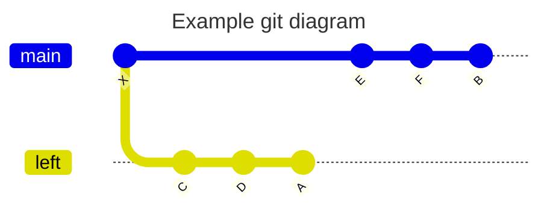

# Git Notation That I always forget

This page will probably become the list of Git stuff that I am always confused about, for a future me to understand it.

> Note that the following examples uses git log, for git diff the `...` operator behaves rather strangely.

## .. operator

- Most git operations like `log` `log` require us to provide commit id. Most uses cases require to compare between two branches, say master and current branch, i.e:

```bash
git log master..branch
```

- A..B, in set theoritic notation, `A..B = B - A`. Following example might give more idea



```bash
-- applying
git log A..B
-- results in: Commit: {E, F}
```

- Or the reverse operation-

```bash
-- applying
git log B..A
-- results in: Commit: {C, D}

```

## ... operator

- In set theoritic notation `A...B = (A - B) ∪ (B - A)
- In this way, `A...B == B...A` (excluding when its invoked with `git diff`)
- Basically, give me all commits apart from the shared ones.

```bash
-- Following the git diagram from .. operator section
-- applying
git log A...B
-- this will result in Commits: {E, F, C, D}
```
